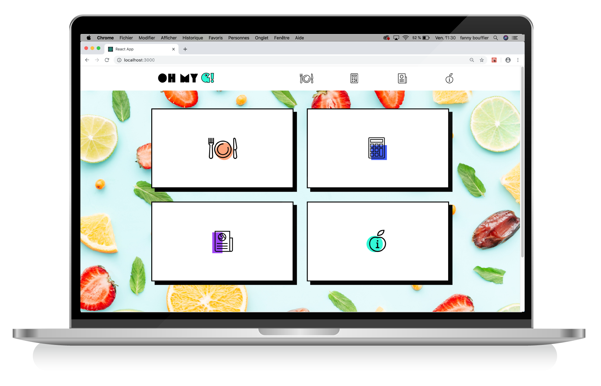
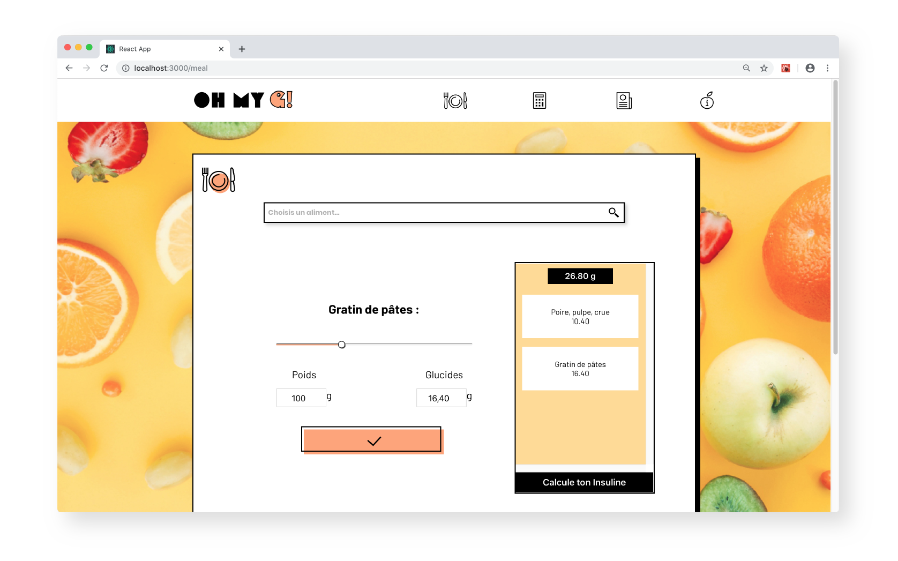
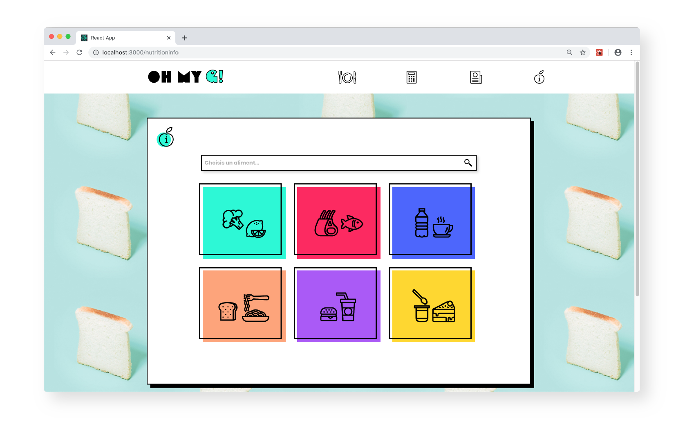

# Oh my G! Project

A web app which helps teenagers to deal with their diabetes everyday. Features : a tool to calculate insuline, a tool to calculate total carbohydrates from food intake and a nutritional informations database.

#### Homepage


#### Meal Calculation


#### Nutritional Informations Database



#### Installation

```bash
git clone https://github.com/paulinedrouhin/Paris-0919-P2-Diabete.git
cd Front
npm install
cd ../Back
npm install
```

**Database Installation** 
----------
_This project uses a MySQL database. To initialize it, I suggest you use a docker container._<br />
_If you'd rather use your local MySQL, jump to "MySQL Database initialization"_

**Docker Installation** <br />
https://docs.docker.com/install/linux/docker-ce/ubuntu/ <br />

**MySQL Docker Image Installation** <br />

_**Note**: If MySQL's already installed and running on your machine, you might want to stop it by using :_
```
$ sudo service mysql stop
```
_or use a different port than 3306 for your MySQL image_ <br />

run the following commands : <br />
(for the first one you will need to modify yourPassword with the MySQL password of your choice, without the < >)

```
$ docker run --name mysqldb -e MYSQL_ROOT_PASSWORD=<yourPassword>, -d -p 3306:3306 mysql:5.7  
```

```
$ docker start mysqldb
```

```
$ docker exec -it mysqldb mysql -u root -p 

**MySQL Database initialization** <br />
Run the Back/add-food-script.SQL in MySQL

**Project connexion to database** <br />
To connect the project to our database, you need to create a .env file at the root of the project that contains: <br />
```
DB_HOST=localhost
DB_USER=root
DB_PWD=<yourPassword>,
DB_DB=alsid
```

#### Development

```bash
Front/npm start
Back/npm start
```

#### Production

```bash
npm run production
```

[](http://forthebadge.com)
